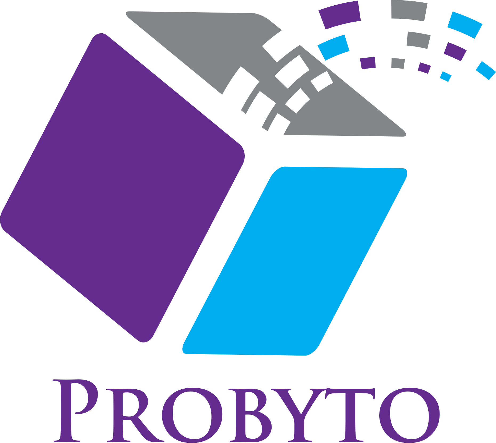

    

## Directory layout

- [`App/Components`](App/Components): presentational components
- [`App/Config`](App/Config): configuration of the application
- [`App/Containers`](App/Containers): container components, i.e. the application's screens
- [`App/Assets`](App/Assets): assets (image, audio files, ...) used by the application
- [`App/Navigators`](App/Navigators): react navigation navigators 
- [`App/Sagas`](App/Sagas): redux sagas
- [`App/Services`](App/Services): application services, e.g. API clients
- [`App/Stores`](App/Stores): redux [actions, reducers and stores](https://redux.js.org/basics)
- [`App/Theme`](App/Theme): base styles for the application

For more information on each directory, click the link and read the directory's README.

## Requirements

Node 8 or greater is required. Development for iOS requires a Mac and Xcode 9 or up, and will target iOS 9 and up.

You also need to install the dependencies required by React Native:

- for [Android development](https://facebook.github.io/react-native/docs/getting-started.html#installing-dependencies-3)
- for [iOS development](https://facebook.github.io/react-native/docs/getting-started.html#installing-dependencies)

## Running the project

Assuming you have all the requirements installed, you can setup and run the project by running:

- `yarn install` to install the dependencies
- create your [configuration file `App/Config/index.js`](App/Config) from `index.dev.js` (if you are in dev environment) and fill the missing values
- run the following steps for your platform

### Android

- only the first time you run the project, you need to generate a debug key with:
  - `cd android/app`
  - `keytool -genkey -v -keystore debug.keystore -storepass android -alias androiddebugkey -keypass android -keyalg RSA -keysize 2048 -validity 10000`
  - `cd ../..` to come back to the root folder
- `yarn start` to start the metro bundler, in a dedicated terminal
- `yarn android` to run the Android application (remember to start a simulator or connect an Android phone)

### iOS

- `cd ios`
- `pod install` to install pod dependencies
- `cd ..` to come back to the root folder
- `yarn start` to start the metro bundler, in a dedicated terminal
- `yarn ios` to run the iOS application (remember to start a simulator or connect an iPhone phone)

## Useful documentation

### Deployment

- Using [Fastlane](https://fastlane.tools/) to automate builds and store deployments (iOS and Android)
  - [Distributing beta builds](docs/beta%20builds.md)

### Package dependencies

- You may want to use [CocoaPods](https://cocoapods.org/) to manage your dependencies (iOS only) 
  - [Using CocoaPods to manage your package dependencies](docs/setup%20cocoapods.md)
  
  
## Troubleshooting

### App fails to start after renaming

If your application fails to start after using the `yarn run rename` command, please take a look at [this issue](https://github.com/thecodingmachine/react-native-boilerplate/issues/34)

